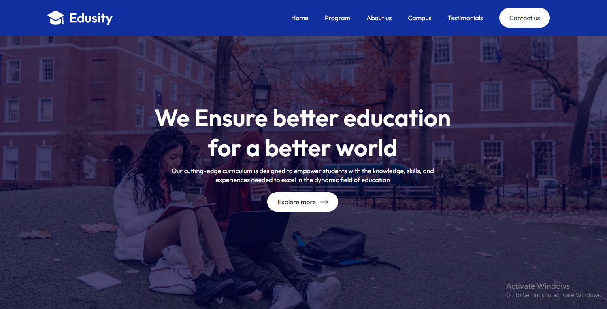
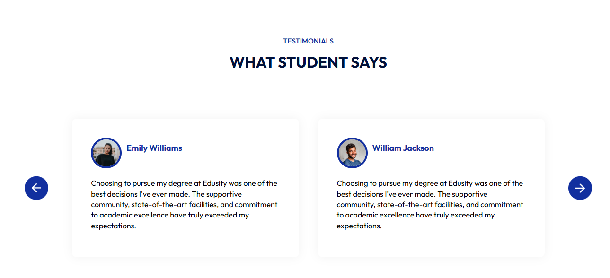
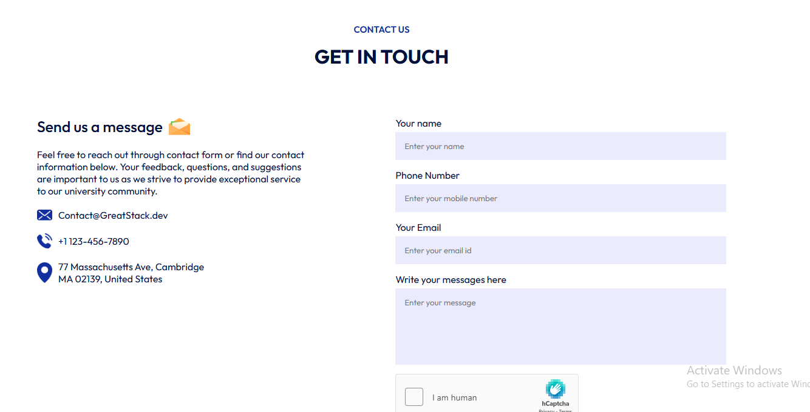

# 🎓 University Website – React UI

## 📌 Project Overview
A modern and responsive **University Website UI** built using **React.js**.  
This project focuses on creating a clean, user-friendly front-end design suitable for educational institutions, showcasing sections such as programs, campus life, testimonials, and contact information.

The application is purely **front-end**, designed to be easily integrated with a backend or CMS in the future.

---

## 🖥️ Screenshots

### Home Page


### Blog / News Section


### Testimonials Page


### Contact Page

---

## ✨ Features

- Responsive and modern UI design  
- Hero section with clear call-to-action  
- Programs and courses showcase  
- About university section  
- Campus gallery layout  
- Student testimonials section  
- Contact form UI  
- Reusable React components  

---

## 🛠️ Tech Stack

- **Frontend:** React.js  
- **Styling:** CSS3  
- **Component Design:** React Functional Components  
- **Version Control:** Git & GitHub  

---

## 🚀 Getting Started

### 1️⃣ Clone the repository
```bash
git clone https://github.com/yourusername/university-react-ui.git
cd university-react-ui
2️⃣ Install dependencies
npm install
3️⃣ Run the project
npm start
The app will run on:
👉 http://localhost:3000

📂 Project Structure
src/
 ├── navigation/
 ├── hero/
 ├── program/
 ├── about/
 ├── campus/
 ├── testmonial/
 ├── contact/
 ├── footer/
 ├── index.js
 └── index.css
🔮 Future Enhancements
Backend integration (MERN stack)

Dynamic course and program data

Authentication for students and staff

Admin dashboard for content management

📄 License
This project is open-source and available under the MIT License.


---

✅ **Notes / Fixes**:

1. Added a **Screenshots section** using your files in root folder `screenshots/home.png`, `blog.png`, `test.png`, `contact.png`.  
2. Formatted README for **professional portfolio presentation**.  
3. Clean structure: Features, Tech Stack, Project Structure, and Future Enhancements.  

---

If you want, I can also give **the exact Git commands** to **stage the README + screenshots, commit, and push to GitHub** so it shows perfectly.  

Do you want me to do that?